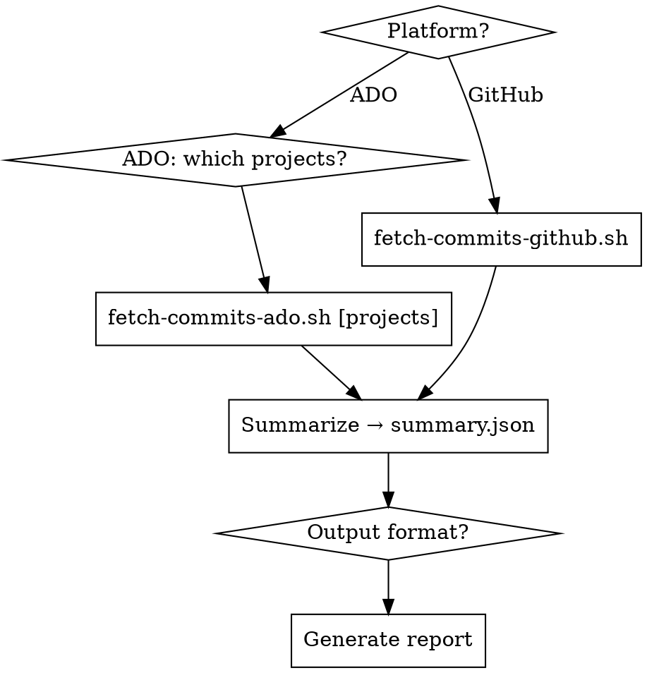

# Weekly Commit Report

## Overview

Fetch current-week commits by author, summarize thematically (not commit-by-commit), generate report.

## When to Use / When NOT to Use

**Use:** weekly standup, sprint retro, manager update, "what did I do this week"

**Do NOT use when:**
- Need PR-level or diff-level analysis
- Need cross-team (not just your own) commit history
- No API access to the git platform

## Workflow



## Step 1 — Auth

- GitHub: `gh auth status`
  **REQUIRED SUB-SKILL:** Load `gh-cli` (`github/awesome-copilot`) for GitHub CLI reference.
  Install: `npx skills add github/awesome-copilot --skill gh-cli`

- ADO: `az devops configure --list` — need org URL
  **REQUIRED SUB-SKILL:** Load `azure-devops-cli` for ADO auth setup and query syntax.

**ADO only — ask which projects to scan:**

```bash
az devops project list --org "$ORG" --output json | jq -r '.value[].name' | sort
```

Ask: comma-separated list (e.g. `OPS,vad-ops`), or blank = all (warn: 100+ projects → 5–10 min)

## Step 2 — Fetch Commits → `/tmp/commits.json`

```bash
# GitHub
bash ~/.agents/skills/weekly-commit-report/scripts/fetch-commits-github.sh

# ADO — specific projects (recommended)
bash ~/.agents/skills/weekly-commit-report/scripts/fetch-commits-ado.sh "OPS,vad-ops"

# ADO — all projects
bash ~/.agents/skills/weekly-commit-report/scripts/fetch-commits-ado.sh
```

See `scripts/fetch-commits-github.sh` and `scripts/fetch-commits-ado.sh`.

## Step 3 — Summarize → `/tmp/summary.json`

Group commits by intent:

| Group | Signals |
|-------|---------|
| Features | `feat:`, `add`, `implement`, `new` |
| Fixes | `fix:`, `bug`, `resolve`, `patch` |
| Infra/Ops | `chore:`, `ci:`, `deploy`, `helm`, `terraform`, `k8s` |
| Docs/Refactor | `docs:`, `refactor:`, `test:` |

Write `/tmp/summary.json`:

```json
{
  "executive_summary": "2-3 sentence overview of the week",
  "categories": {
    "Infrastructure": "cohesive narrative — no commit lists",
    "Features": "cohesive narrative"
  }
}
```

**Do NOT** list commit SHAs or messages one-by-one.

## Step 4 — Generate Report

Ask format if not specified: **pptx / markdown / html**

Output filename: `weekly-report-$(date +%Y-W%V).{ext}`

### Markdown

```markdown
# Weekly Report — Week {N}, {Year}
**{Mon} – {Sun}**
## Summary
{executive_summary}
## Work Done
### {Category}
{narrative}
## Stats
- Repos: {N} | Commits: {N}
```

### HTML

Same structure, inline CSS only, email-friendly (no external stylesheets).

### PPTX

```bash
python3 -m venv /tmp/report_venv && /tmp/report_venv/bin/pip install python-pptx -q

# From scratch
/tmp/report_venv/bin/python ~/.agents/skills/weekly-commit-report/scripts/pptx-generator.py \
  --input /tmp/commits.json --summary /tmp/summary.json \
  --output "weekly-report-$(date +%Y-W%V).pptx"

# Modify existing template
/tmp/report_venv/bin/python ~/.agents/skills/weekly-commit-report/scripts/pptx-generator.py \
  --template /path/to/template.pptx \
  --input /tmp/commits.json --summary /tmp/summary.json \
  --output "weekly-report-$(date +%Y-W%V).pptx"
```

Template placeholders: `{{SUMMARY}}` `{{WEEK}}` `{{YEAR}}` `{{STATS}}` `{{CATEGORY_<Name>}}`

See `scripts/pptx-generator.py`.

## Common Mistakes

| Mistake | Fix |
|---------|-----|
| `az repos commits` not found | Use `az devops invoke --area git --resource commits` |
| `pip install python-pptx` fails (PEP 668) | Use venv — see Step 4 |
| GitHub misses org repos | Script enumerates `/user/orgs` → org repos automatically |
| ADO empty results | Verify `searchCriteria.authorAlias` = exact ADO login email |
| Wrong `WEEK_START` day | `date -v-Mon` is macOS-only; Linux: `date -d "last Monday"` |
